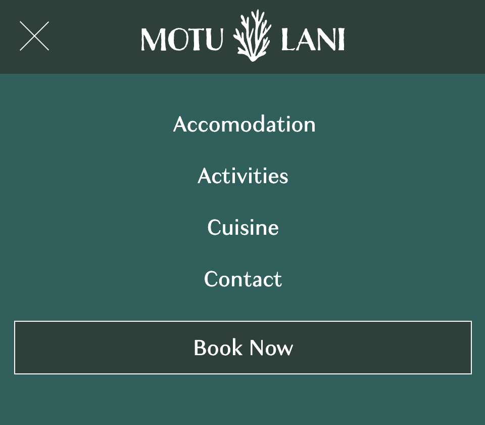

# Motu Lani


The Motu Lani site was built to fufill the goals of two stakeholders, the owners of the Motu Lani Resort and consumers looking for a luxury vacation in the Pacific.

#### Motu Lani Owner Goals
- Increase bookings of the Motu Lani Resort
- Increase awareness of the resort with an online presence 
- Enhance the Motu Lani brand

#### Consumer Goals
- Learn about the Motu Lani resort and reasons for staying there
- Get a taste for the Motu Lani resort experience through the website's visual design 
- Make a booking request or contact the resort for information

## Design Process
This section outlines the design process and design thinking that occured when developing the Motu Lani site.

### UX Design

#### User Stories

- As a user, I would like to see what accomodation is available at Motu Lani.

- As a user, I would like to learn about the food and activities available at the Motu Lani resort.

- As a user, I would like to make a booking request with Motu Lani.

- As a user, I would like to learn how to get to Motu Lani.

#### Wireframes

[Desktop wireframes can be viewed here](readme_assets/desktop_wireframes.pdf)

[Mobile wireframes can be viewed here](readme_assets/mobile_wireframes.pdf)

### Visual Design

#### Moodboard

Before proceeding with creating the visual design I developed a [moodboard](readme_assets/moodboard.pdf) to draw inspiration from.

#### Colour Scheme

I took an image that represented the aesthetics I had in mind for the Motu Lani design system and uploaded to it Adobe Creative Cloud where a colour palette was then generated.


#### Typography
Motu Lani makes use of three font families from [Adobe Fonts](https://fonts.adobe.com)

- [Charcuterie Contrast](https://fonts.adobe.com/fonts/charcuterie-contrast) is used for the logo
- [Granville](https://fonts.adobe.com/fonts/granville) is used for headings
- [DJR Forma Display](https://fonts.adobe.com/fonts/forma-djr-display) is used for paragraphs of text.


For the logo and headings I selected typefaces that had a Polynesian aesthetic. This wouldn't have been appropriate for paragraphs of text where legibility and uniformity is more important. 

#### High fidelity mockups

Before building Motu Lani mockups were made in Figma.


## Features

The Motu Lani project involved building a response website that would work accross mobile, tablet and desktop devices. The website allows users to learn more about the Motu Lani resort and perform tasks like subscribe to their email newsletter, send an enquiry and make a reservation request. 

### Existing Features

- **Primary Navigation (on all pages except form_submission.html)**
	- There is a responsive navigation system. On larger screen devices a navigation menu is present below the logo providing quick access to the site pages. On smaller screens a burger menu icon appears, when this is pressed by the user they enter a full screeen navigation menu which can be retracted by pressing the close button.
	- The navigation system allows the user to easily navigate between different pages. The layout encourages page discovery.
	- The navigation features a call-to-action, this will make easy for users to quickly find the page to make a booking. This should help increase conversion for the Motu Lani resort owners.

	

	

- **Secondary Navigation**
	- Pages with categories of content feature a secondary navigation in the header section. This is to provide the user with quick access to the category they are most intersted in and to prevent unecessary scrolling for the user. On browsers that support `scroll-behavior: smooth;` this navigation uses smooth scrolling for a better user experience.

	

	

- **Newsletter form (on all pages except form_submission.html)**
	- In the footer there is a form that allows users to subscribe to the Motu Lani newsletter. 
	- This is beneficial to site visitors as it provides a simple mechanism for them to easily stay up to date with Motu Lani developments and receive special offers.
	- The subscribe to newsletter feature will help the Motu Lani owners with their digital marketing efforts.

	

- **Home Page Video**
	- The top of the home page features an auto-playing background video overlayed with the page heading and sub-heading. The video grabs the attention of the user and sets the theme for both the rest of the website and the Motu Lani resort.
	- On small screen devices a CTA is also shown over the video, encouraging users to book as the desktop navigation is not visible.

	

- **Home Page Gallery**
	-	To give users a feel for the experience offered at the Motu Lani resort there is an image gallery. The gallery is useful to users as it shows what the island is like and the experience on offer.

	

- **Back to top feature**
	-	The accomodation, activities and cuisine pages feature a link that will take the user back to the top of the page. It features smooth scrolling (in browsers that support this) for a nice user experience and saves the user from having to do lots of scrolling if they wish to go back to the top of the page.

	

- **Information Cards**
	- The activities and cuisine pages both feature information cards. These cards present information about the difference activities and dining venues in a clear way using a technique called 'chunking'. This is where content is ring fenced from other content, making dense content easy to scan and digest.


	

- **Contact Form**
	- There is a contact form allowing users to easily contact the Motu Lani resort about any enquiries they might have. The form features validation ensuring an email address must be entered into the email field and that all fields must be fille dbefore submission is possible. 
	- The form has been broken down into three simple steps, allowing the form to breathe and creating a simple user flow. This will make it more likely for users to complete the form, ensuring the Motu Lani owners get as many enquries as possible, maybe leading to more bookings and customer engagement. 
	- When a field in the form is active the background colour changes, providing feedback for the user.


	

- **Booking Request Form**
	- The booking page features a booking request form, allowing users to send a reservation request. This is valuable to the user at it makes it easy for them to make a booking request without havign to phone the resort or sending an email. The form reduces friction in the reservation process, increasing bookings for the Motu Lani resort owners.
	- The form has been broken down into five simple steps, creating a logical user flow and grouping the required information. This approach improves the UX of filling out the form, a generally tedious process where user abandons are common. 
	- The form is benefcial to the Motu Owners as it standardises booking requests and reduces administration efforts. The form validation requires all required fields to be filled before submitting. Date pickers ensure vlid date formats are submitted.
	- The accomodation pictures with radio buttons visually indicate to the user what accomodation option they are picking, reducing the chance of the incorrect accomodation choice being made whilst filling out the form.
	- When a field in the form is active the background colour changes, providing visual feedback for the user.


	

- **Form submission confirmation**
	- When any of the three forms are submitted on the Motu Lani site they will automatically be taken to a confirmation page. 
	- This is a good UX practice as it acknolwedges that the user's action has been successfully completed. This prevents the user submitting the same form duplicate times.
	- This page features a tick animation, emphasizing that the form was submitted.
	- Users are automatically redirected to the home page after a few seconds, but should this fail there is a link to take them there. This eliminates the need for the user to use the back button when navigating around the Motu Lani site.


	

- **Motu Lani Map**
	- The contact page features a map showing the location of Motu Lani in relation to the interational airport. I have used a subtle CSS animation to highlight the island.
	

	
	
### Features Left to Implement

- Currently the website has a booking form where users can submit booking requests. What would really enhance the project is to add a live booking system, where users can see dynamic pricing + availability with the ability make a booking themselves.
- Adding live chat functionality as a contact option.
- Adding a website blog so that the Motu Lani resort can keep former and prospective guests updated on resort developments.

## Technologies Used

The Motu Lani projected was created using the following technologies:
- HTML - hypertext markup language is the standard language for designing files to be displayed in a web browser like Chrome or Safari. The most recent of HTML is version 5 which is what the Motu Lani project uses.

- CSS - cascading style sheets is a language used for styling a file written in a markup language like HTML.

- JavaScript (ES11) is a scripting language and one of the main technologies of web development. In Motu Lani it was used to implement a responsive mobile navigation system with animated burger icon, add a date to the copyright disclaimer and to conrol +/- form control. 

## Tools Used

- For writing code I used [Visual Studio Code](https://code.visualstudio.com/) which I also for Git commands and pushing to GitHub

- [GitHub](https://github.com]) was used for hosting the online repository, it provides an online version of Git, a source code management tool.

- [TinyPNG](https://tinypng.com) was used to optimise all .JPEG and .PNG images to ensure efficient loading for the end user.

- Adobe Illustrator was used for vector graphic design, like for the logo, coral reef list bullets and map.

- [Figma](https://figma.com) was used to create high fidelity mockups before I started coding. 

- [Markdown Editor](https://apps.apple.com/ie/app/markdown-editor/id1458220908?mt=12) by Satoshi Iwaki was used for editing .MD files.

	- *In both of my .MD files I have used the HTML image tag in certain situtions. The Markdown syntax does not support [specifiying image size](https://www.markdownguide.org/hacks/#image-size) width which was necessary for readability of these doucments.*

- [AutoPrefixer](https://autoprefixer.github.io/) was used to add browser specifc prefixes.
	
## Testing

- For all testing, please refer to the [TESTING.md](TESTING.md) file.

## Deployment

The site was deployed to GitHub pages. The steps to deploy are as follows: 
  - In the [GitHub repository](https://github.com/ancfoster/Motu-Lani), navigate to the Settings tab 
  - From the source section drop-down menu, select the **Main** Branch, then click "Save".
  - The page will be automatically refreshed with a detailed ribbon display to indicate the successful deployment.

The live link can be found [here](https://ancfoster.github.io/Motu-Lani)

### Local Deployment

In order to make a local copy of this project, you can clone it. In your IDE Terminal, type the following command to clone my repository:

- `git clone https://github.com/ancfoster/Motu-Lani.git`

Alternatively, if using Gitpod, you can click below to create your own workspace using this repository.

[](https://gitpod.io/#https://github.com/ancfoster/Motu-Lani)

## Credits

### Content
I used an acessibiility guide provided by [Orange](https://a11y-guidelines.orange.com/en/articles/accessible-svg/) on how to provide screen-reader support for an inline SVG.

I used a code snippet from StackOverflow user [Elad Amsaalem](https://stackoverflow.com/questions/11671100/scale-path-from-center) on how to properly scale an SVG path element.

```.scaled-path-svg { svg { path {transform-origin: center; transform: scale(1.1); } } } ```

### Media
#### Home Page

[Video Background](https://www.pexels.com/video/beach-waves-rushing-to-shore-4611805/)

[Gallery Resort Image](https://www.pexels.com/photo/picturesque-view-of-tropical-island-7832616/)

[Gallery Outrigger Image](https://www.pexels.com/photo/man-riding-on-boat-holding-brown-paddle-1170807/)

[Gallery Restaurant Image](https://www.pexels.com/photo/brown-wooden-dock-on-body-of-water-1724438/)

[Gallery Bridge Image](https://www.pexels.com/photo/a-couple-walking-on-the-bridge-9149366/)

[Gallery Sunset Image](https://www.pexels.com/photo/silhouette-photo-couple-kissing-each-other-during-sunset-1024982/)

[Accommodation Image – Over Water Bungalows](https://www.pexels.com/photo/aerial-photography-of-bungalows-1287460/)

[Activities Scuba Image](https://www.pexels.com/photo/person-takes-photo-of-tortoise-1645028/)

[Cuisine Image Lobster](https://www.pexels.com/photo/seafood-on-bowl-2532439/)

[Contact Island Image](https://www.pexels.com/photo/beach-vacation-relaxation-ocean-7079776/)

#### Activities Page

[Header Background Scuba Turtle](https://www.pexels.com/photo/person-takes-photo-of-tortoise-1645028/)

[Two Tank Snorkel Image](https://www.pexels.com/photo/man-in-black-diving-suit-in-water-7169293/)

[Coral Garden](https://www.pexels.com/photo/scenic-photo-of-coral-reef-3157890/)

[Sunset Cruise](https://www.pexels.com/photo/full-sunset-over-boat-on-sea-10085110/)

[Fire Dancing](https://www.pexels.com/photo/a-man-in-hawaiian-traditional-fire-dance-7226891/])

[Pearl Farm](https://www.flickr.com/photos/bruchez/7185806319)

[Massage 1](https://www.pexels.com/photo/a-woman-having-a-massage-6663361/)

[Massage 2](https://www.pexels.com/photo/black-stones-on-woman-s-back-5378218/)

#### Accommodation Page

[Header Background Image](https://www.pexels.com/photo/huts-near-body-of-water-1506836/)

[Residence G1](https://www.pexels.com/photo/a-beautiful-floating-villa-9482135/)

[Residence G2](https://www.pexels.com/photo/a-beautiful-floating-villa-9482135/)

[Residence G5](https://www.pexels.com/photo/infinity-pool-near-beach-3155666/)

[Residence G4](https://upload.wikimedia.org/wikipedia/commons/5/5a/FPO_BOR_126.jpg)

[Residence G3](https://cdn.pixabay.com/photo/2015/03/18/21/20/sunrise-680031_1280.jpg)

[Bungalow G1](https://www.pexels.com/photo/cluster-of-beige-huts-above-water-1287454/)

[Bungalow G2](https://www.pexels.com/photo/brown-wicker-chairs-and-table-beside-body-of-water-2549018/)

[Bungalow G3](https://www.pexels.com/photo/hotel-house-architecture-inside-7587866/)

[Bungalow G4](https://www.pexels.com/photo/woman-leaning-on-handrail-in-room-1838554/)


#### Cuisine Page 

[Elements Restaurant Image](https://www.pexels.com/photo/brown-wooden-table-and-chairs-on-beach-3660229/)

[East Meets West Image](https://www.pexels.com/photo/dish-on-ceramic-plates-2792186/])

[Header Image](https://www.pexels.com/photo/sushi-roll-on-tray-and-table-3475617/])

[Lobster Image](https://www.pexels.com/photo/seafood-on-bowl-2532439/)

[Room Service](https://www.pexels.com/photo/food-photography-breakfast-on-bread-illustration-196668/)

#### Booking Page

[Header background](https://www.pexels.com/photo/picturesque-view-of-tropical-island-7832616/)

[Residence thumbnail](https://www.pexels.com/photo/a-beautiful-floating-villa-9482135/)

[Bungalow thumbnail](https://www.pexels.com/photo/cluster-of-beige-huts-above-water-1287454/)


#### Contact Page
[Header Image background](https://www.pexels.com/photo/beach-vacation-relaxation-ocean-7079776/)

[Plane Image](https://www.pexels.com/photo/plane-on-sandy-beach-near-sea-7832609/)

#### Icons
Footer social icons, back-to-top arrow icon and telephone icon are from [Iconmonstr](https://iconmonstr.com)

### Acknowledgements
I would like to thank my Code Institute mentor Tim Nelson for providing invaluable guidance duirng the development of this project. I also wish to thank my wife Alice for helping me by testing the Moti Lani site and prodiving user feedback.
