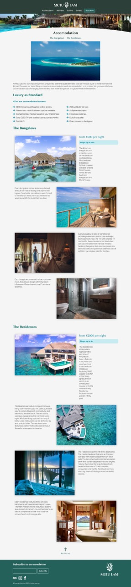
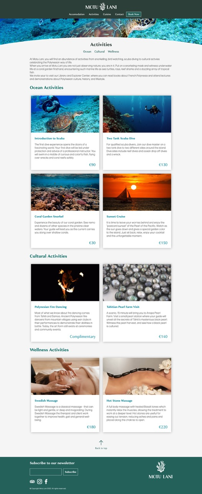

# Testing
Click to return back to the [README.md](README.md)
## Browser Compatibility

- **index.html**

| Browser | Screenshot |
|---|---|
|||
|||
|||

- **accomodation.html**

| Browser | Screenshot |
|---|---|
|||
|||
|||

- **activities.html**

| Browser | Screenshot |
|---|---|
|||
|||
|||

- **cuisine.html**

| Browser | Screenshot |
|---|---|
|||
|||
|||

- **contact.html**

| Browser | Screenshot |
|---|---|
|||
|||
|||

- **booking.html**

| Browser | Screenshot |
|---|---|
|||
|||
|||

## Code Validation
#### W3C HTML Validator
All HTML files have passed through the W3C validator.

| File | Validator Result |
|---|---|
|index.html|[Link](https://validator.w3.org/nu/?doc=https%3A%2F%2Fancfoster.github.io%2FMotu-Lani%2Findex.html)|
|accomodation.html|[Link](https://validator.w3.org/nu/?doc=https%3A%2F%2Fancfoster.github.io%2FMotu-Lani%2Faccomodation.html)|
|activities.html|[Link](https://validator.w3.org/nu/?doc=https%3A%2F%2Fancfoster.github.io%2FMotu-Lani%2Factivities.html)|
|booking.html|[Link](https://validator.w3.org/nu/?doc=https%3A%2F%2Fancfoster.github.io%2FMotu-Lani%2Fbooking.html)|
|contact.html|[Link](https://validator.w3.org/nu/?doc=https%3A%2F%2Fancfoster.github.io%2FMotu-Lani%2Fcontact.html)|
|cuisine.html|[Link](https://validator.w3.org/nu/?doc=https%3A%2F%2Fancfoster.github.io%2FMotu-Lani%2Fcuisine.html)|
|form_submission.html|[Link](https://validator.w3.org/nu/?doc=https%3A%2F%2Fancfoster.github.io%2FMotu-Lani%2Fform_submission.html)|

#### W3C CSS Validator
All CSS files have passed through the W3C validator.

| File | Validator Result |
|---|---|
|style.css|[Link](https://jigsaw.w3.org/css-validator/validator?uri=https%3A%2F%2Fancfoster.github.io%2FMotu-Lani%2Fassets%2Fcss%2Fstyle.css&profile=css3svg&usermedium=all&warning=1&vextwarning=&lang=en)|
|home_styles.css|[Link](https://jigsaw.w3.org/css-validator/validator?uri=https%3A%2F%2Fancfoster.github.io%2FMotu-Lani%2Fassets%2Fcss%2Fhome_styles.css&profile=css3svg&usermedium=all&warning=1&vextwarning=&lang=en)|
|accomodation_styles.css|[Link](https://jigsaw.w3.org/css-validator/validator?uri=https%3A%2F%2Fancfoster.github.io%2FMotu-Lani%2Fassets%2Fcss%2Faccomodation_styles.css&profile=css3svg&usermedium=all&warning=1&vextwarning=&lang=en)|
|activity_styles.css|[Link](https://jigsaw.w3.org/css-validator/validator?uri=https%3A%2F%2Fancfoster.github.io%2FMotu-Lani%2Fassets%2Fcss%2Factivity_styles.css&profile=css3svg&usermedium=all&warning=1&vextwarning=&lang=en)|
|booking_styles.css|[Link](https://jigsaw.w3.org/css-validator/validator?uri=https%3A%2F%2Fancfoster.github.io%2FMotu-Lani%2Fassets%2Fcss%2Fbooking_styles.css&profile=css3svg&usermedium=all&warning=1&vextwarning=&lang=en)|
|contact_styles.css|[Link](https://jigsaw.w3.org/css-validator/validator?uri=https%3A%2F%2Fancfoster.github.io%2FMotu-Lani%2Fassets%2Fcss%2Fcontact_styles.css&profile=css3svg&usermedium=all&warning=1&vextwarning=&lang=en)|
|cuisine_styles.css|[Link](https://jigsaw.w3.org/css-validator/validator?uri=https%3A%2F%2Fancfoster.github.io%2FMotu-Lani%2Fassets%2Fcss%2Factivity_styles.css&profile=css3svg&usermedium=all&warning=1&vextwarning=&lang=en)|
|form_submission_styles.css|[Link](https://jigsaw.w3.org/css-validator/validator?uri=https%3A%2F%2Fancfoster.github.io%2FMotu-Lani%2Fassets%2Fcss%2Fform_submission_styles.css&profile=css3svg&usermedium=all&warning=1&vextwarning=&lang=en)|

## Responsiveness

- **index.html**

| Device | Screenshot |
|---|---|
| iPhone SE 2 (375 x 667) | |
| Nexus 7 Tablet (600 x 960) |  |
| Laptop MDPI (1280 x 800) |  |

- **index.html**

| Device | Screenshot |
|---|---|
| iPhone SE 2 (375 x 667) | |
| Nexus 7 Tablet (600 x 960) |  |
| Laptop MDPI (1280 x 800) |  |

- **index.html**

| Device | Screenshot |
|---|---|
| iPhone SE 2 (375 x 667) | |
| Nexus 7 Tablet (600 x 960) |  |
| Laptop MDPI (1280 x 800) |  |

- **accomodation.html**

| Device | Screenshot |
|---|---|
| iPhone SE 2 (375 x 667) | |
| Nexus 7 Tablet (600 x 960) |  |
| Laptop MDPI (1280 x 800) |  |

- **index.html**

| Device | Screenshot |
|---|---|
| iPhone SE 2 (375 x 667) | |
| Nexus 7 Tablet (600 x 960) |  |
| Laptop MDPI (1280 x 800) |  |

- **index.html**

| Device | Screenshot |
|---|---|
| iPhone SE 2 (375 x 667) | |
| Nexus 7 Tablet (600 x 960) |  |
| Laptop MDPI (1280 x 800) |  |

- **index.html**

| Device | Screenshot |
|---|---|
| iPhone SE 2 (375 x 667) | |
| Nexus 7 Tablet (600 x 960) |  |
| Laptop MDPI (1280 x 800) |  |

## User Story Testing (if you have user stories from the README)
    if so, just copy/paste your user stories here, and then provide a screenshot of each from the finished site, usually this is a combo of UserStory+Feature screenshot
## Unfixed Bugs

- Not a bug, but in Safari on iOS/iPad OS devices the index.html background video does not play. This is a [documented issue](https://developer.apple.com/forums/thread/690523) and not something I can fix.