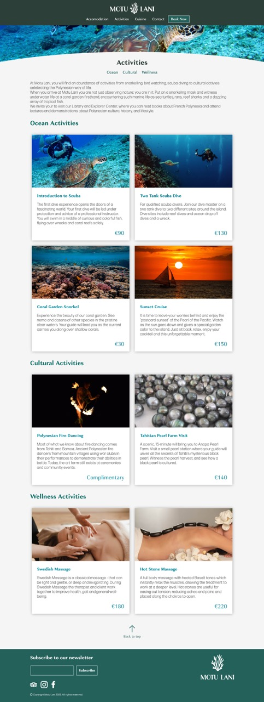
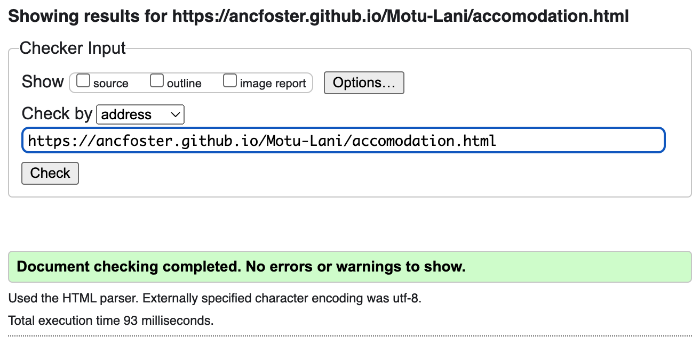
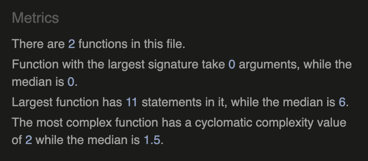
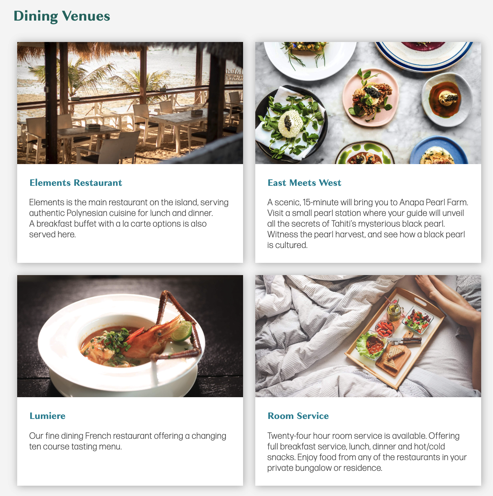
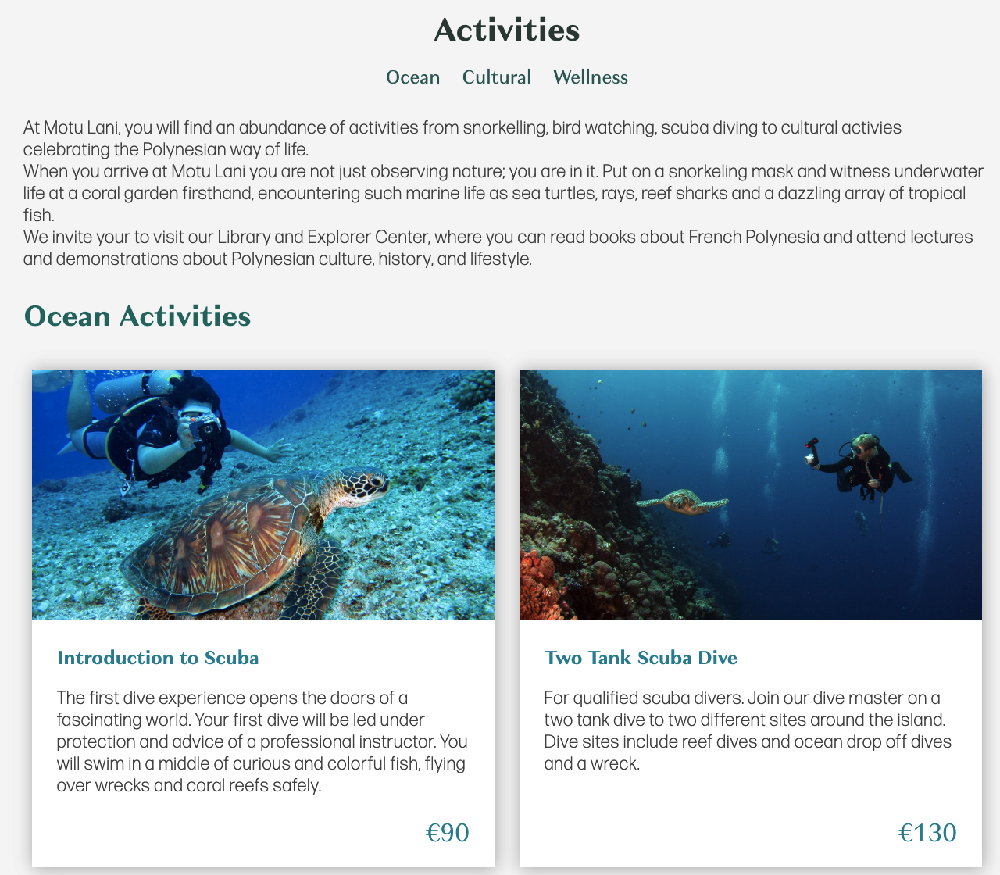

# Testing
Click to return back to the [README.md](README.md)
## Browser Compatibility

- **index.html**

| Browser | Screenshot |
|---|---|
|||
|||
|||

- **accomodation.html**

| Browser | Screenshot |
|---|---|
|||
|||
|||

- **activities.html**

| Browser | Screenshot |
|---|---|
|||
|||
|||

- **cuisine.html**

| Browser | Screenshot |
|---|---|
|||
|||
|||

- **contact.html**

| Browser | Screenshot |
|---|---|
|||
|||
|||

- **booking.html**

| Browser | Screenshot |
|---|---|
|||
|||
|||

## Code Validation
#### W3C HTML Validator
All HTML files have passed through the W3C validator.

| File | Validator Result | Screenshot |
|---|---|---|
|index.html|[Link](https://validator.w3.org/nu/?doc=https%3A%2F%2Fancfoster.github.io%2FMotu-Lani%2Findex.html)||
|accomodation.html|[Link](https://validator.w3.org/nu/?doc=https%3A%2F%2Fancfoster.github.io%2FMotu-Lani%2Faccomodation.html)||
|activities.html|[Link](https://validator.w3.org/nu/?doc=https%3A%2F%2Fancfoster.github.io%2FMotu-Lani%2Factivities.html)||
|booking.html|[Link](https://validator.w3.org/nu/?doc=https%3A%2F%2Fancfoster.github.io%2FMotu-Lani%2Fbooking.html)||
|contact.html|[Link](https://validator.w3.org/nu/?doc=https%3A%2F%2Fancfoster.github.io%2FMotu-Lani%2Fcontact.html)||
|cuisine.html|[Link](https://validator.w3.org/nu/?doc=https%3A%2F%2Fancfoster.github.io%2FMotu-Lani%2Fcuisine.html)||
|form_submission.html|[Link](https://validator.w3.org/nu/?doc=https%3A%2F%2Fancfoster.github.io%2FMotu-Lani%2Fform_submission.html)||

#### W3C CSS Validator
All CSS files have passed through the W3C validator.

| File | Validator Result | Screenshot |
|---|---|---|
|style.css|[Link](https://jigsaw.w3.org/css-validator/validator?uri=https%3A%2F%2Fancfoster.github.io%2FMotu-Lani%2Fassets%2Fcss%2Fstyle.css&profile=css3svg&usermedium=all&warning=1&vextwarning=&lang=en)||
|home_styles.css|[Link](https://jigsaw.w3.org/css-validator/validator?uri=https%3A%2F%2Fancfoster.github.io%2FMotu-Lani%2Fassets%2Fcss%2Fhome_styles.css&profile=css3svg&usermedium=all&warning=1&vextwarning=&lang=en)||
|accomodation_styles.css|[Link](https://jigsaw.w3.org/css-validator/validator?uri=https%3A%2F%2Fancfoster.github.io%2FMotu-Lani%2Fassets%2Fcss%2Faccomodation_styles.css&profile=css3svg&usermedium=all&warning=1&vextwarning=&lang=en)||
|activity_styles.css|[Link](https://jigsaw.w3.org/css-validator/validator?uri=https%3A%2F%2Fancfoster.github.io%2FMotu-Lani%2Fassets%2Fcss%2Factivity_styles.css&profile=css3svg&usermedium=all&warning=1&vextwarning=&lang=en)||
|booking_styles.css|[Link](https://jigsaw.w3.org/css-validator/validator?uri=https%3A%2F%2Fancfoster.github.io%2FMotu-Lani%2Fassets%2Fcss%2Fbooking_styles.css&profile=css3svg&usermedium=all&warning=1&vextwarning=&lang=en)|||
|contact_styles.css|[Link](https://jigsaw.w3.org/css-validator/validator?uri=https%3A%2F%2Fancfoster.github.io%2FMotu-Lani%2Fassets%2Fcss%2Fcontact_styles.css&profile=css3svg&usermedium=all&warning=1&vextwarning=&lang=en)||
|cuisine_styles.css|[Link](https://jigsaw.w3.org/css-validator/validator?uri=https%3A%2F%2Fancfoster.github.io%2FMotu-Lani%2Fassets%2Fcss%2Fcuisine_styles.css&profile=css3svg&usermedium=all&warning=1&vextwarning=&lang=en)||
|form_submission_styles.css|[Link](https://jigsaw.w3.org/css-validator/validator?uri=https%3A%2F%2Fancfoster.github.io%2FMotu-Lani%2Fassets%2Fcss%2Fform_submission_styles.css&profile=css3svg&usermedium=all&warning=1&vextwarning=&lang=en)||

#### JSHint 
All JavaScript code was analysed with [JSHint](https://jshint.com)

| File | Screenshot |
|---|---|
|scripts.js||
|booking.js||

## Responsiveness

- **index.html**

| Device | Screenshot |
|---|---|
| iPhone SE 2 (375 x 667) | |
| Nexus 7 Tablet (600 x 960) |  |
| Laptop MDPI (1280 x 800) |  |

- **accomodation.html**

| Device | Screenshot |
|---|---|
| iPhone SE 2 (375 x 667) | |
| Nexus 7 Tablet (600 x 960) |  |
| Laptop MDPI (1280 x 800) |  |

- **activities.html**

| Device | Screenshot |
|---|---|
| iPhone SE 2 (375 x 667) | |
| Nexus 7 Tablet (600 x 960) |  |
| Laptop MDPI (1280 x 800) |  |

- **cuisine.html**

| Device | Screenshot |
|---|---|
| iPhone SE 2 (375 x 667) | |
| Nexus 7 Tablet (600 x 960) |  |
| Laptop MDPI (1280 x 800) |  |

- **contact.html**

| Device | Screenshot |
|---|---|
| iPhone SE 2 (375 x 667) | |
| Nexus 7 Tablet (600 x 960) |  |
| Laptop MDPI (1280 x 800) |  |

- **booking.html**

| Device | Screenshot |
|---|---|
| iPhone SE 2 (375 x 667) | |
| Nexus 7 Tablet (600 x 960) |  |
| Laptop MDPI (1280 x 800) |  |

## User Story Testing (if you have user stories from the README)

- As a user, I would like to see what accomodation is available at Motu Lani.

	

- As a user, I would like to learn about the food and activities available at the Motu Lani resort.

	

	

- As a user, I would like to make a booking request with Motu Lani.

	

- As a user, I would like to learn how to get to Motu Lani.

	

## Unfixed Bugs

- Not a bug, but in Safari on iOS/iPad OS devices the index.html background video does not play. This is a [documented issue](https://developer.apple.com/forums/thread/690523) and not something I can fix.
- Safari prior to version 15.5 `scroll-behavior: smooth;` does not work.
- On Safari for iOS/iPad OS the submit form buttons feature rounded corner and are not the correct size. This behaviour does not occur on Safari for macOS and persists despite the use of vendor prefixes for Webkit.